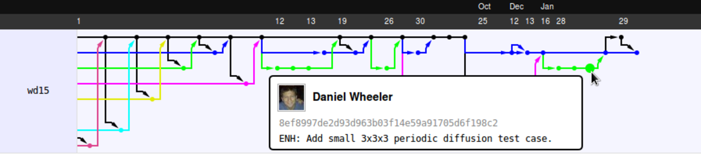

% Title
% Daniel Wheeler
% 2014-04-27

# {#overview .step data-scale=8}

   
# {#title .step data-y=-2500 data-scale=4}

Simulation and Data Management

    Daniel Wheeler &bull;
    April 29, 2014 &bull;
    Diffusion Workshop

# {#automate .step data-y=200 data-x=-800}

# {#automate .step data-y=200 data-x=-800}

 

 Automate 

# About me {.step data-y=200 data-x=800}

 
scientific/academic code developer
 
 
run/manage simulations (code monkey)
 
 
an epic Pythonista (according to OSRC)
 
 
interested in reproducible research
 
 
see <code class="twitter">@wd15dan</code>

# Imagine... {.step .alwaysshow data-y=200 data-x=2400}

 
A declarative metadata standard
 that you can use to
tell a Linux VM how to download your data, execute your computational
analysis, and spin up an interface to a literate computing environment
with the analysis preloaded. Then we can provide buttons on scientific
papers that say "run this analysis on Rackspace! or Amazon! Estimated
cost: $25".

 
Automated integration tests for papers 

where you provide the metadata to run your analysis while you're
working on your paper and a service automatically pulls down your
analysis source and data, runs it, and generates your figures for you
to check. Then when the paper is ready to submit, the journal takes
your metadata format and verifies it themselves, and passes it on to
reviewers with a little "reproducible!" tick mark.

 
ideas by *C. Titus Brown*

# Orthogonal Issues {#orthogonal .step .alwaysshow data-y=2500}

# Workflow Control {.step .alwaysshow data-y=2720 data-x=180}

# Scientific Workflow {.step data-y=2000 data-x=500 data-scale=0.2}

</img>

<!-- # {#versioncontrol .step .alwaysshow data-y=2910 data-x=-680 data-rotate-z="45"} -->

# {.step .alwaysshow data-y=2500}

# Version Control {.step .alwaysshow data-y=3110 data-x=-280 data-rotate-z="45"}

# {#vc .step data-y=3110 data-x=-280 data-rotate-z="45"}

</img>
 
maintains history of workflow changes 
 
 
but not workflow usage
 
 
integrated into many scientific workflows

# Easy to use {.step data-y=3200 data-x=-500 data-rotate-z="45" data-scale=0.2}

~~~~{.console}
$ git init
$ git add file.txt
$ git ci -m "add file.txt"
$ edit file.txt
$ git ci -am "edit file.txt"
$ git log
12e3c2618143 add file.txt
e00433e69a43 edit file.txt
$ git push github master
~~~~

# Manage Complexity {.step data-y=3350 data-x=-350 data-rotate-z="-45" data-scale=0.2}

# {.step .alwaysshow data-y=2500}  

# Event Control {.step .alwaysshow data-rotate-z="-45" data-y=2700 data-x=560 }

# {.step data-rotate-z="-45" data-y=2700 data-x=560 }

 
provide a **unique ID (SHA checksum)** for every workflow execution
 
 
capture **meta-data**, not data
 
 
**not** workflow control or version control
 
 
partial solution: **Sumatra**, a simulation management tool (not workflow)

# {.step .alwaysshow data-y=2500}  

# Sumatra {.step data-x=-1000 data-y=1200 data-scale=0.5}

 
**doesn't change my workflow**
 
 
records the **meta-data** (not the data): parameters, environment, data
location, time stamps, output images, commit message, duration, data hash
 
 
generates **unique ID** for each simulation

# Easy to use {#easytouse1 .step data-x=-200 data-y=1200 data-scale=0.5}

~~~~{.console}
$ smt init smt-demo
$ smt configure --executable=python --main=script.py
$ smt run --tag=demo --reason="create demo record" params.json wait=3
Record label for this run: '0c50797f1e3f'
No data produced.
Created Django record store using SQLite
~~~~

# Easy to use {#easytouse2 .step data-x=-200 data-y=1200 data-scale=0.5}

~~~~{.console}
$ smt list --long
------------------------------------------------------------------------
Label            : 6c9c7cd2bbc2
Timestamp        : 2014-04-21 16:07:52.100838
Reason           : create demo record
Outcome          : 
Duration         : 3.26091217995
Repository       : GitRepository at /home/wd15/git/diffusion-worksho ...
Main_File        : script.py
Version          : 08d04df6a9b561eb146d3a7461f763869fdc48a7
Script_Arguments : <parameters>
Executable       : Python (version: 2.7.6) at /home/wd15/anaconda/bi ...
Parameters       : {
                 :     "wait": 3
                 : }
Input_Data       : []
Launch_Mode      : serial
Output_Data      : []
User             : Daniel Wheeler <daniel.wheeler2@gmail.com>
Tags             : demo
Repeats          : None
~~~~

# Web Interface {#webinterface .step data-x=800 data-y=1200 data-scale=0.5}

<iframe width="100%" height="100%" src="http://127.0.0.1:8000/" frameborder="0" border="0"> </iframe>

# Sumatra + IPython + Pandas { .step data-x=1800 data-y=1200 data-scale=0.5}

 
high level data manipulation
 
 
quickly mix parameters, meta-data and output data in a dataframe
 
 
save Sumatra records as HDF file
 
 
disseminate instantly using [nbviewer.ipython.org](http://nbviewer.ipython.org/)

# Using Pandas {#usingpandas .step data-x=2800 data-y=1200 data-scale=0.5}

~~~~{.console}
$ smt export
$ ipython
~~~~
~~~~{.python}
>>> import json, pandas
>>> with open('.smt/records_export.json') as f:
...     data = json.load(f)     
>>> df = pandas.DataFrame(data)
>>> custom_df = df[['label', 'duration', 'tags']]
>>> custom_df
   label         duration  tags
0  6c9c7cd2bbc2  3.260912  [demo]
1  db8610f0c51f  3.248754  [demo]
2  0fdaf12e0cb2  3.247553  [demo]
...
>>> custom_df.to_hdf('records.h5')
~~~~

# Using IPython {#webinterface2 .step data-x=3800 data-py=1200 data-scale=0.5}

<iframe width="100%" height="100%" src="http://wd15.github.io/2013/05/07/extremefill2d/" frameborder="0" border="0"> </iframe>

# {.step data-y=200 data-x=2400}

# The Fantasy {.step data-x=3400 data-y=200 data-scale=0.5}

 
cloud service for Sumatra
 
 
integrated with Github, Buildbot and a VM provider
 
 
**sumatra-server 0.1.0** is out!  

# Thanks! {.step data-x=4400 data-y=200 data-scale=0.5}

 
slides: [wd15.github.io/diffusion-workshop-2014](http://wd15.github.io/diffusion-workshop-2014/)
 
 
parallel demo: [github.com/wd15/smt-demo](https://github.com/wd15/smt-demo)
